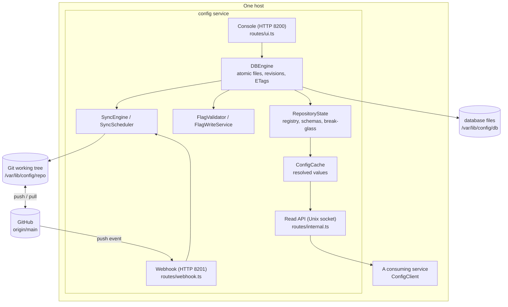
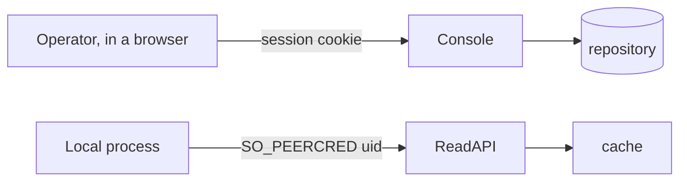
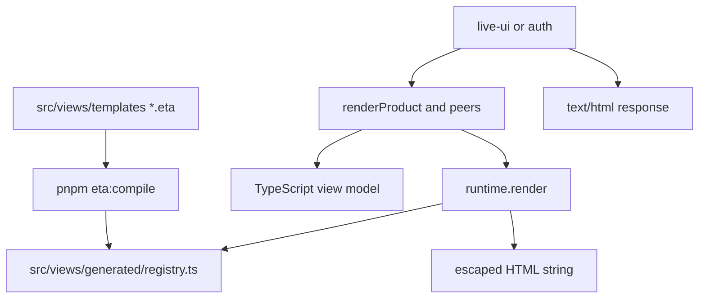

# Architecture

`config.anudeep.pro` is a configuration registry backed by an on-host file database. Configuration
is edited through a console, served to processes on the same host over a Unix socket, and
synchronized to Git as an auditable backup.

## Why a file database with a Git mirror

The database is the immediate source of truth: each validated write is atomic, receives a
monotonic revision, and wakes the in-memory cache without waiting for network access. Git is the
durable off-host mirror and audit medium. `SyncEngine` copies database files into the Git working
tree, commits attribution from `WriteJournal`, and retries pushes after an outage. A Git rollback
is imported through the normal synchronization/bootstrap path rather than being read directly by
the serving path.

## Components

## Responsibilities

| Component | Responsibility | Boundary it defends |
|---|---|---|
| `AccessGuard` | Decides whether a uid may read a namespace | The only authorization decision for served values; asked per request so a revocation needs no restart |
| `ServiceRegistry` | The grant table, from `services.yaml` | A uid clash throws at load rather than being resolved at request time |
| `SchemaSet` | Types, bounds and secrecy of every key | Validation happens at save, while the operator is looking at the screen |
| `ProductWriteOperations` (`ConfigWriteService`) | Create, save, retire, archive, promote, delete-keys | The only product writer; validate, encrypt, compare-and-swap into `DBEngine` |
| `DBEngine` | Atomic multi-file writes, revisions, ETags | Crash-safe publication; SyncEngine mirrors afterwards |
| `RepositoryState` | One rebuilt object holding registry, schemas and break-glass | Rebuilt in one order — registry before values — so a revocation can never lag a value |
| `ConfigCache` | Resolved values for the served revision | Read path never touches git |
| `SopsEncryptor` / `SopsDecryptor` | Encryption at rest | Encryptor reads `.sops.yaml` from the git clone (`CONFIG_REPO_DIR`), not `db/` |
| Logging (`configureLogging`, `LogDbSink`) | Stdout JSON plus optional Postgres `log.app_log` / `log.access_log` | Fail-open; secrets never become log fields; `request_sid` joins every line to a request |

## Integrations

## Integrations

- **GitHub** over SSH with a write-scoped deploy key (`CONFIG_GIT_SSH_KEY`), and an optional push
  webhook. Both are optional: with no remote the registry is local-only and the console says so.
- **iam** for operator sign-in over OpenID Connect (OIDC). While iam is reachable and OIDC
  is configured, unauthenticated console requests `302` to `/login/iam` (then IAM) with a
  safe relative `next` path. After `/login/callback`, the session cookie is set and the
  browser returns to `next` (default `/`). When iam is unreachable, break-glass sign-in
  opens — that is the only condition under which it does. When iam is up but OIDC env is
  missing, the sign-in page says so; it does not offer break-glass. Locally, `https://iam.anudeep.pro`
  is Caddy on the host (loopback 443 → IAM `:8000` and console `:8200`, one SAN certificate);
  the `app` container uses `extra_hosts` and `NODE_EXTRA_CA_CERTS` (`make iam-caddy`). Health remains HTTP on `host.docker.internal:8000`.
- **SOPS** and **age** for encryption. Each namespace file carries its own envelope.
- **Postgres `log-db`** (Compose) for application and access logs. Not the config file store.

## Trust boundaries

The console authenticates a **person**; the read API authenticates a **process**, by the kernel's
own credential on the socket rather than anything the caller sends. Neither trusts the other's
input: a POST body is user input however the form was rendered, and a namespace read is refused
before the cache is consulted so an ungranted caller cannot learn that a namespace exists.

## Decisions that shape the code

- **Save is live.** A validated write reaches `db/` and watching consumers without a publish step.
  Git sync is a **back-up**, never "not yet in effect". Auto sync defaults **off**. Manual **Sync
  changes now** confirms a list of journal rows and unpushed commits. Failures stick as problem
  notices (`backup-failed`, `backup-deferred`) until a successful sync or dismiss.
- **Ticks select Promote and Delete only.** They write nothing by themselves.
- **The registry declares the topology.** `services.yaml` decides which products exist and which
  uid may read what; `environments.yaml` decides which environments exist. Nothing is inferred
  from which files happen to be present.

## File-based data engine

### Product-write migration: transaction foundation (slice 1)

`DBEngine.writeMany()` is the common mutation boundary for single-file writes, deletes, and
batches. `TransactionJournal` owns private redo intents and staged file contents under
`db/.journal/transactions/<uuid>/`. `FileWriter` flushes file contents and directory entries before
acknowledging replacement. The existing attribution `WriteJournal` remains a separate concern;
transaction payloads never enter Git or the served configuration.

Per-path locks cover validation, comparison, and staging. A publication lock protects ordered
replacement, the revision, attribution callbacks, and intent completion. Unrelated products can
stage concurrently; publication and consistent snapshot reads briefly share that lock. This is
an in-process, single-owner database, not coordination between multiple writer processes.

The production sync engine consumes `DBEngine.snapshot()` so a backup cannot mix files from
the middle of a transaction. The repository view also reads file contents and revision together.
The product-write cutover is complete: create, save, retire, archive, promote, and delete-keys
all use `writeMany()` with the ordering rules that keep partial states inert.

The database engine stores authoritative files under `CONFIG_DB_PATH` and exposes atomic reads,
writes, deletes, revisions, and SHA-256 entity tags. `FileWriter` performs temp-file replacement;
`DBEngine` performs path-scoped serialization and compare-and-swap checks. Git remains a mirror,
updated by `SyncEngine` when Auto sync is on (idle writes and the configured interval), or when
an operator confirms **Sync changes now**. Preference is `${CONFIG_DB_PATH}/.journal/auto-sync.json`.

`flags.yaml` is plaintext and validated by `FlagValidator` (TitleCase names with optional digits);
configuration files remain encrypted
by SOPS. `ConfigCache` serves decrypted configuration and resolved per-environment flags from
memory, so the Unix socket read path does not depend on Git or disk availability.

## Console HTML rendering

Operator pages are Eta files under `src/views/templates/` (layout, partials, pages).
`pnpm eta:compile` compiles them to `src/views/generated/registry.ts` (gitignored). Request
handlers still call `render*` functions; those functions build view models and call compiled
template functions. Production `node dist/server.js` does not read `.eta` files. Auto-escape is
on; `include` inserts already-escaped HTML. `@fastify/view` is not used.

The page footer is `src/views/templates/footer.eta` and the console tabs are
`src/views/templates/header.eta`. Both sit outside `#page`. htmx swaps of `#page` leave them
in place. `updateHeader` appends `#pagechrome` with `hx-swap-oob` only when the URL crosses
Products ↔ Features; `updateFooter` does the same for Auto sync. `.pagehead` (title, search,
notices, actions) lives inside `#page` so it updates with the body.

# Direct-write safety checkpoint — 2026-09-10

Direct value writes compare the ciphertext read before decryption with the file at commit. Product creation uses a coherent DB snapshot and checks every participating ETag; retirement checks the schema ETag. The console cutover that removes drafts is complete as of 2026-09-11.
