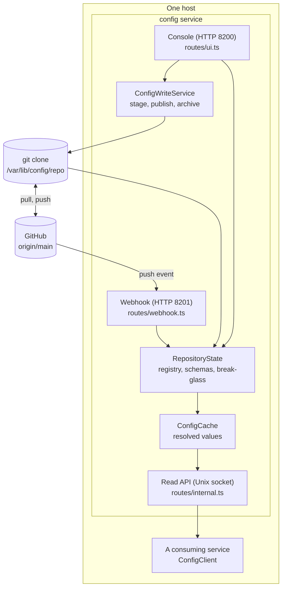
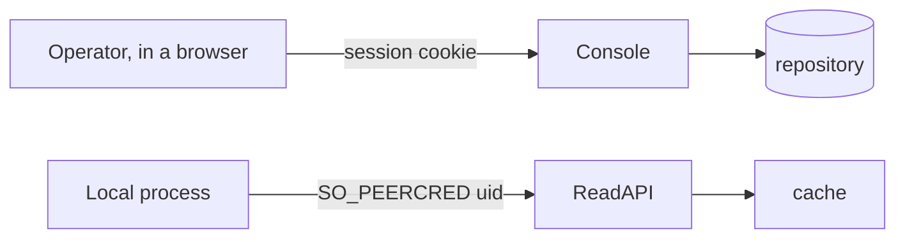

# Architecture

`config.anudeep.pro` is a configuration registry backed by a git repository. Configuration is
edited through a console, published as commits, and served to processes on the same host over a
Unix socket.

## Why a git repository

Every value that reaches a service is a commit: reviewable, attributable, and revertible without
a database. Publishing is therefore not a write to a store — it is a commit, and rolling back is
`git revert`. This decision shapes everything else here, including the fact that a draft is *not*
in git and is therefore not durable.

## Components

## Responsibilities

| Component | Responsibility | Boundary it defends |
|---|---|---|
| `AccessGuard` | Decides whether a uid may read a namespace | The only authorization decision for served values; asked per request so a revocation needs no restart |
| `ServiceRegistry` | The grant table, from `services.yaml` | A uid clash throws at load rather than being resolved at request time |
| `SchemaSet` | Types, bounds and secrecy of every key | Validation happens at save, while the operator is looking at the screen |
| `ConfigWriteService` | Staging, publishing, archiving | The only writer; holds the lock, generates commit messages, encrypts |
| `DraftStore` | Unpublished work, by namespace | Explicitly not durable state: a draft that cannot be understood is dropped |
| `RepositoryState` | One rebuilt object holding registry, schemas and break-glass | Rebuilt in one order — registry before values — so a revocation can never lag a value |
| `ConfigCache` | Resolved values for the served commit | Read path never touches git |
| `SopsEncryptor` / `SopsDecryptor` | Encryption at rest | Secrets never reach a draft, a log, or a page in plaintext |

## Integrations

- **GitHub** over SSH with a write-scoped deploy key (`CONFIG_GIT_SSH_KEY`), and an optional push
  webhook. Both are optional: with no remote the registry is local-only and the console says so.
- **iam** for operator sign-in over OpenID Connect (OIDC). When iam is unreachable, break-glass
  sign-in opens — that is the only condition under which it does.
- **SOPS** and **age** for encryption. Each namespace file carries its own envelope.

## Trust boundaries

The console authenticates a **person**; the read API authenticates a **process**, by the kernel's
own credential on the socket rather than anything the caller sends. Neither trusts the other's
input: a POST body is user input however the form was rendered, and a namespace read is refused
before the cache is consulted so an ungranted caller cannot learn that a namespace exists.

## Decisions that shape the code

- **Drafts are not durable.** They live in one JSON file outside git. A draft that does not say
  what it is (`kind`) is dropped on read rather than guessed at.
- **Everything the console can do is a commit** — except archiving, which is also a commit but
  does not pass through a draft.
- **The registry declares the topology.** `services.yaml` decides which products exist and which
  uid may read what; `environments.yaml` decides which environments exist. Nothing is inferred
  from which files happen to be present.
