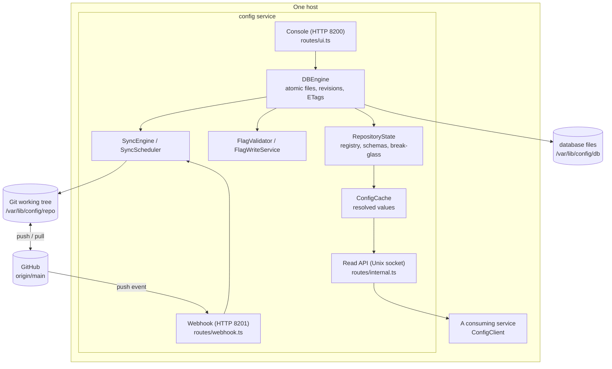
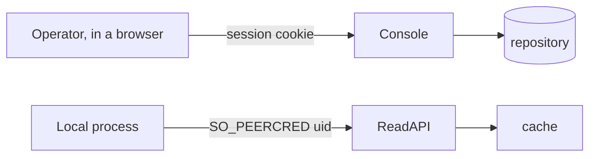

# Architecture

`config.anudeep.pro` is a configuration registry backed by an on-host file database. Configuration
is edited through a console, served to processes on the same host over a Unix socket, and
synchronized to Git as an auditable backup.

## Why a file database with a Git mirror

The database is the immediate source of truth: each validated write is atomic, receives a
monotonic revision, and wakes the in-memory cache without waiting for network access. Git is the
durable off-host mirror and audit medium. `SyncEngine` copies database files into the Git working
tree, commits attribution from `WriteJournal`, and retries pushes after an outage. A Git rollback
is imported through the normal synchronization/bootstrap path rather than being read directly by
the serving path.

## Components

## Responsibilities

| Component | Responsibility | Boundary it defends |
|---|---|---|
| `AccessGuard` | Decides whether a uid may read a namespace | The only authorization decision for served values; asked per request so a revocation needs no restart |
| `ServiceRegistry` | The grant table, from `services.yaml` | A uid clash throws at load rather than being resolved at request time |
| `SchemaSet` | Types, bounds and secrecy of every key | Validation happens at save, while the operator is looking at the screen |
| `ConfigWriteService` | Staging, publishing, archiving | The only writer; holds the lock, generates commit messages, encrypts |
| `DraftStore` | Unpublished work, by namespace | Explicitly not durable state: a draft that cannot be understood is dropped |
| `RepositoryState` | One rebuilt object holding registry, schemas and break-glass | Rebuilt in one order — registry before values — so a revocation can never lag a value |
| `ConfigCache` | Resolved values for the served commit | Read path never touches git |
| `SopsEncryptor` / `SopsDecryptor` | Encryption at rest | Secrets never reach a draft, a log, or a page in plaintext |

## Integrations

- **GitHub** over SSH with a write-scoped deploy key (`CONFIG_GIT_SSH_KEY`), and an optional push
  webhook. Both are optional: with no remote the registry is local-only and the console says so.
- **iam** for operator sign-in over OpenID Connect (OIDC). When iam is unreachable, break-glass
  sign-in opens — that is the only condition under which it does.
- **SOPS** and **age** for encryption. Each namespace file carries its own envelope.

## Trust boundaries

The console authenticates a **person**; the read API authenticates a **process**, by the kernel's
own credential on the socket rather than anything the caller sends. Neither trusts the other's
input: a POST body is user input however the form was rendered, and a namespace read is refused
before the cache is consulted so an ungranted caller cannot learn that a namespace exists.

## Decisions that shape the code

- **Drafts are not durable.** They live in one JSON file outside git. A draft that does not say
  what it is (`kind`) is dropped on read rather than guessed at.
- **Everything the console can do is a commit** — except archiving, which is also a commit but
  does not pass through a draft.
- **The registry declares the topology.** `services.yaml` decides which products exist and which
  uid may read what; `environments.yaml` decides which environments exist. Nothing is inferred
  from which files happen to be present.

## File-based data engine

### Product-write migration: transaction foundation (slice 1)

`DBEngine.writeMany()` is the common mutation boundary for single-file writes, deletes, and
batches. `TransactionJournal` owns private redo intents and staged file contents under
`db/.journal/transactions/<uuid>/`. `FileWriter` flushes file contents and directory entries before
acknowledging replacement. The existing attribution `WriteJournal` remains a separate concern;
transaction payloads never enter Git or the served configuration.

Per-path locks cover validation, comparison, and staging. A publication lock protects ordered
replacement, the revision, attribution callbacks, and intent completion. Unrelated products can
stage concurrently; publication and consistent snapshot reads briefly share that lock. This is
an in-process, single-owner database, not coordination between multiple writer processes.

The production sync engine consumes `DBEngine.snapshot()` so a backup cannot mix files from
the middle of a transaction. The repository view also reads file contents and revision together.
Product flow migration and removal of drafts remain subsequent slices.

The database engine stores authoritative files under `CONFIG_DB_PATH` and exposes atomic reads,
writes, deletes, revisions, and SHA-256 entity tags. `FileWriter` performs temp-file replacement;
`DBEngine` performs path-scoped serialization and compare-and-swap checks. Git remains a mirror,
updated by `SyncEngine` on demand, after idle writes, and on the configured interval.

`flags.yaml` is plaintext and validated by `FlagValidator`; configuration files remain encrypted
by SOPS. `ConfigCache` serves decrypted configuration and resolved per-environment flags from
memory, so the Unix socket read path does not depend on Git or disk availability.
# Direct-write safety checkpoint — 2026-09-10

Direct value writes now compare the ciphertext read before decryption with the file at commit. Product creation uses a coherent DB snapshot and checks every participating ETag; retirement checks the schema ETag. These safeguards do not yet complete the console cutover.
