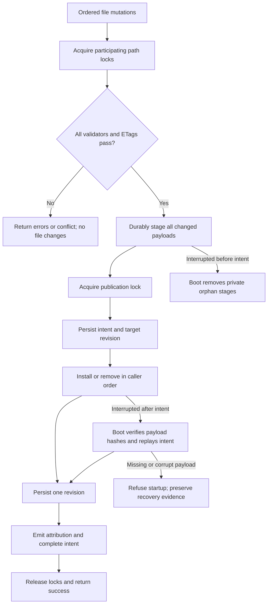
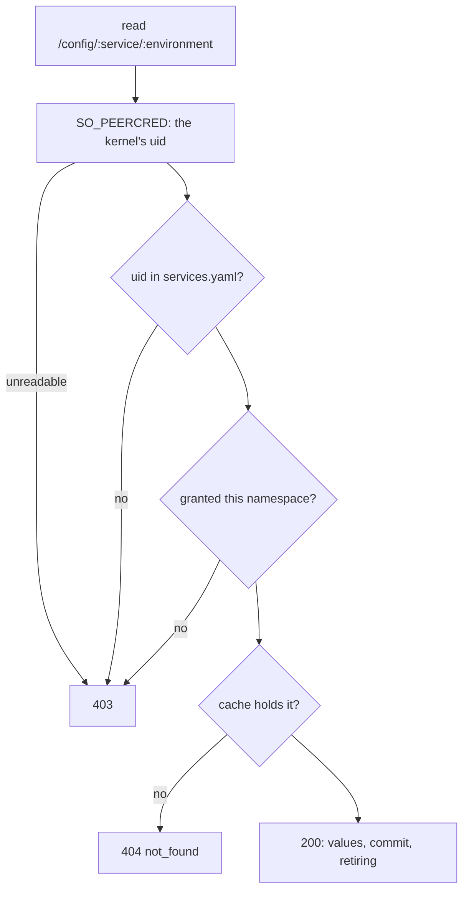
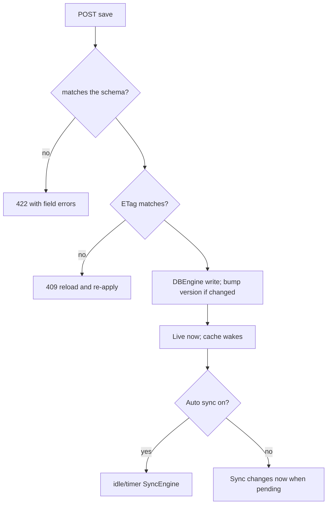
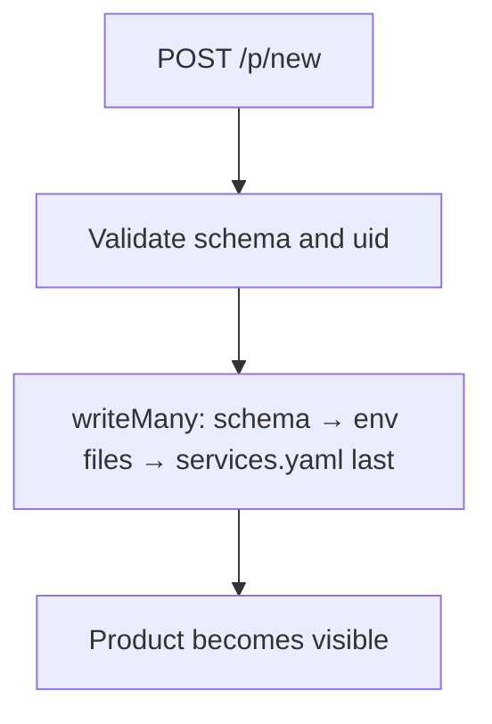
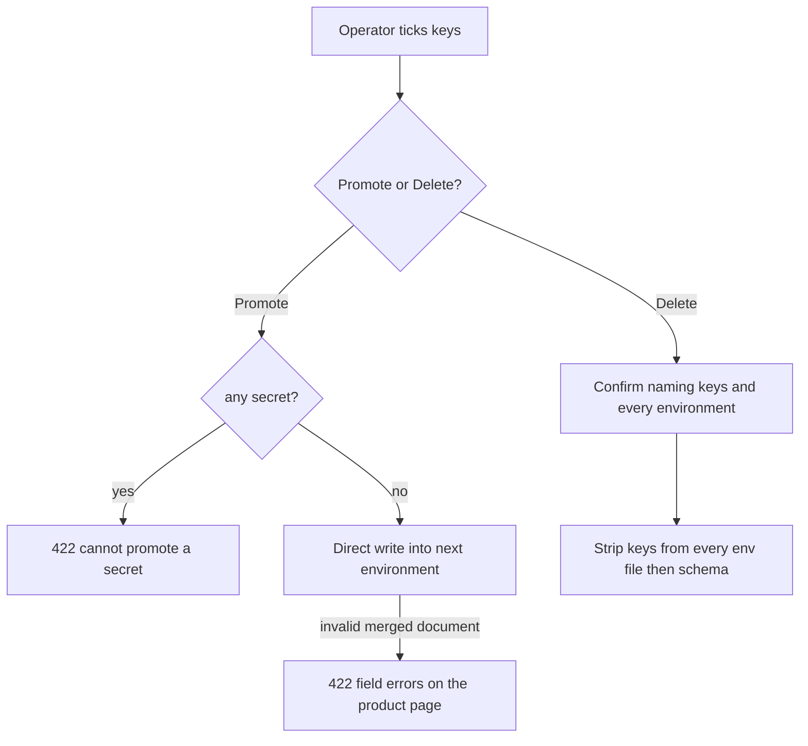
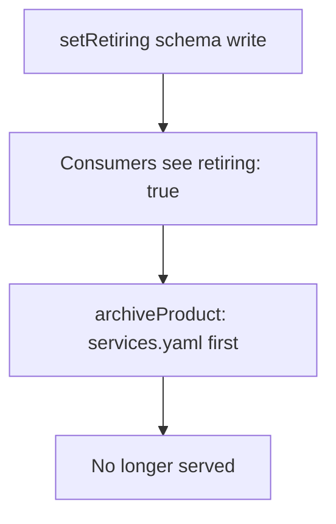
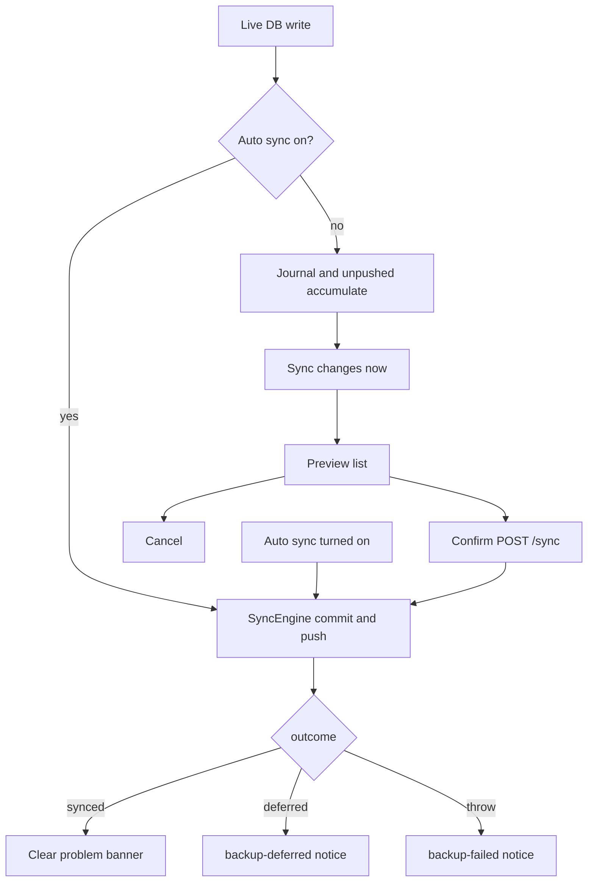
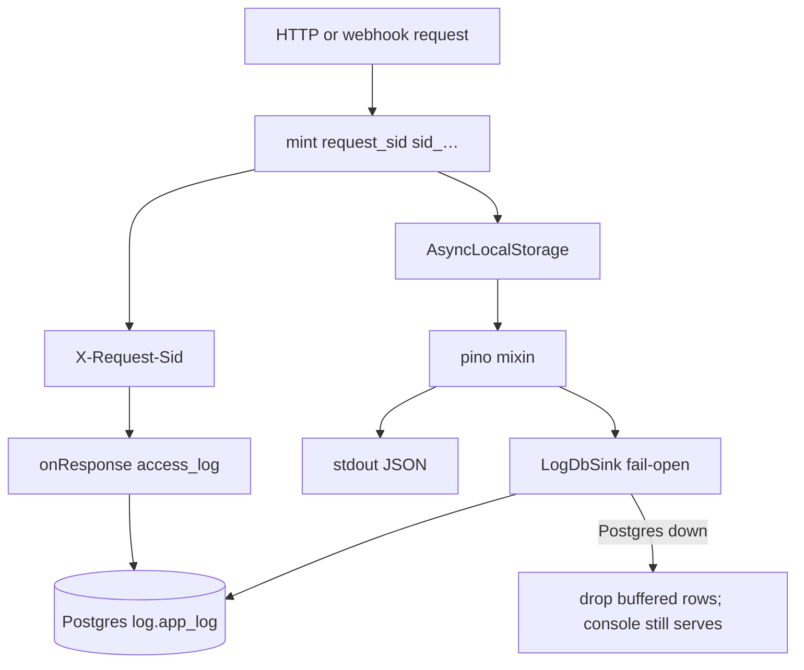

# Flows

## Recoverable database transaction (product-write slice 1)

Database snapshot reads wait for publication and return one complete revision. Sync copies that
snapshot before committing or pushing, so network time does not hold the database lock.

Success, failure, retry, fallback and rollback for every path that writes or serves.

## Serving a value

A denial says nothing about why: an ungranted caller cannot tell a namespace that exists from one
that does not.

## Saving values (live)

## Create product

## Promote and Delete

## Retire and archive

## Git backup (auto-sync off by default)

## Request logging

# Direct-write safety checkpoint — 2026-09-10

Direct-save flow refinement: read ciphertext and ETag → decrypt → validate → compare semantic values → encrypt changed values with incremented version → verify each secret field → compare-and-swap. A concurrent write returns conflict without installing the candidate. A no-op verifies its base without re-encryption.
