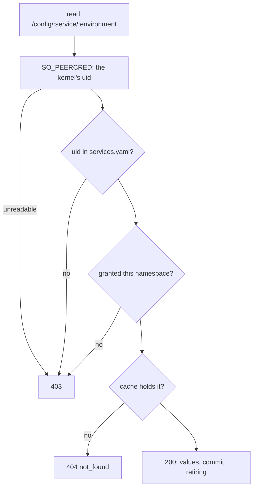
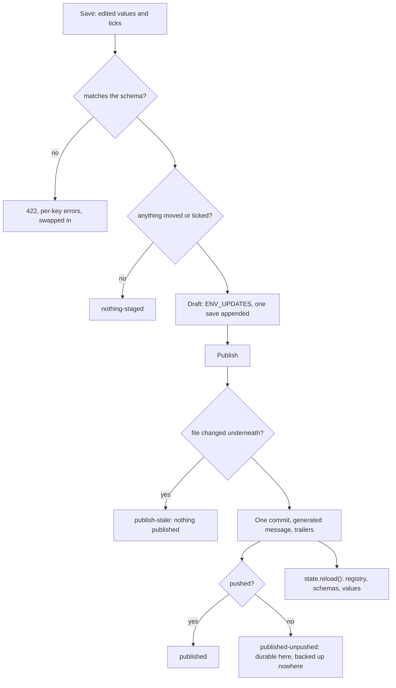
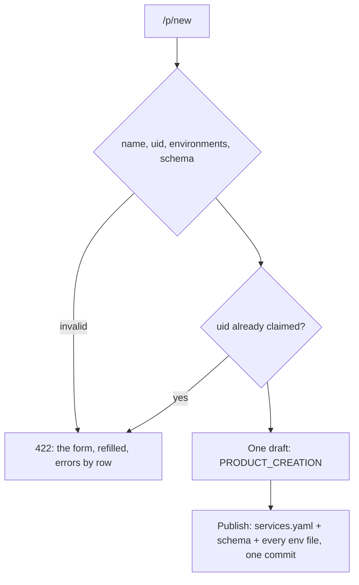
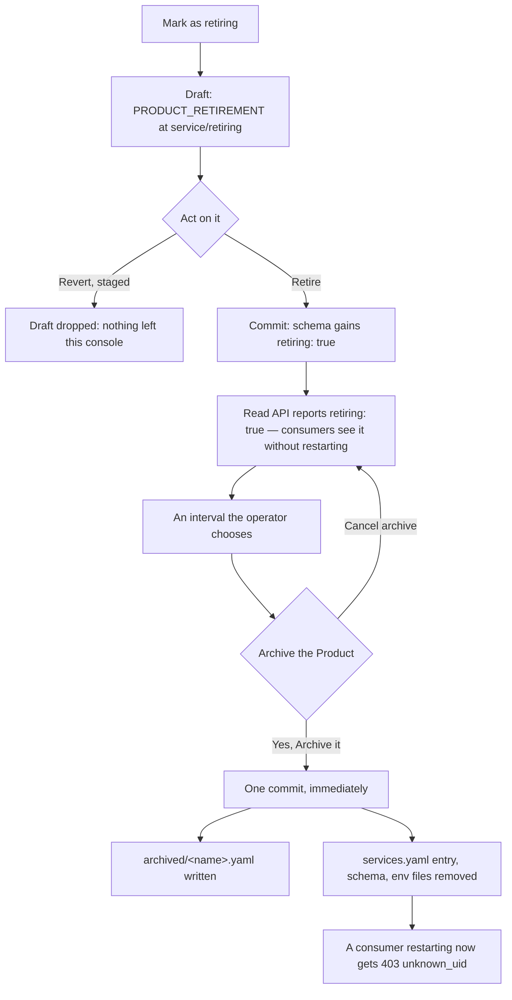
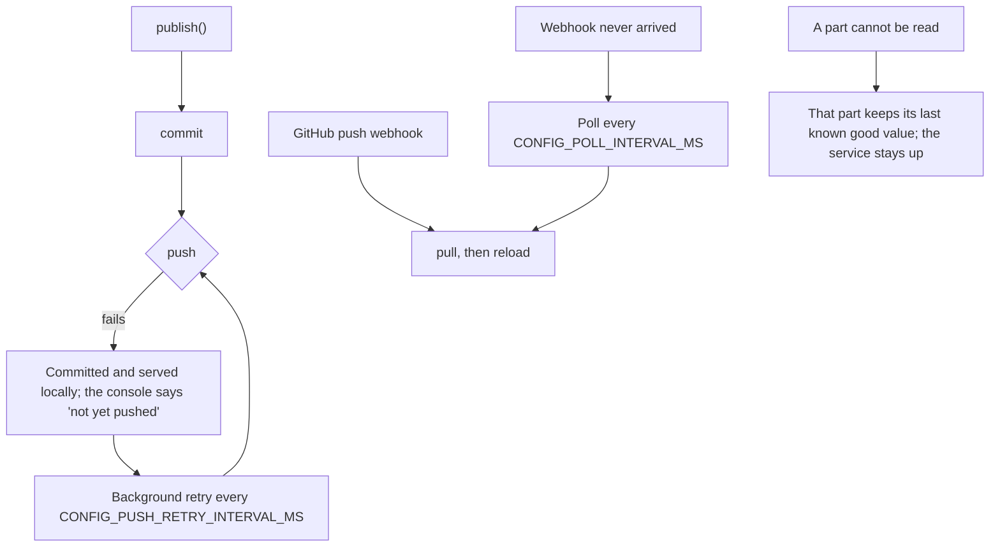

# Flows

Success, failure, retry, fallback and rollback for every path that writes or serves.

## Serving a value

A denial says nothing about why: an ungranted caller cannot tell a namespace that exists from one
that does not.

## Saving and publishing

A tick with no edit is a change: it records intent and bumps the revision without writing a value.

## Creating a product

One draft, because a registry entry without its schema is a product nobody can open and a schema
without its entry is a file nothing reads.

## Retiring, then archiving

The interval between the two steps is the design: a running consumer keeps its last-known-good
values and is told, through the read API, that the product is going.

## Failure, retry and fallback

## Rollback

| What | How |
|---|---|
| A published value | `git revert` the commit; the next reload serves the previous values |
| A published retirement | Revert on the retiring page, or revert the commit |
| An archive | `git revert` the archive commit: the entry, the schema and every environment come back, ciphertext intact |
| A draft | Drop it; nothing reached git |
| The service itself | Deploy the previous image; the repository is the state, and it is unchanged by a rollback |
