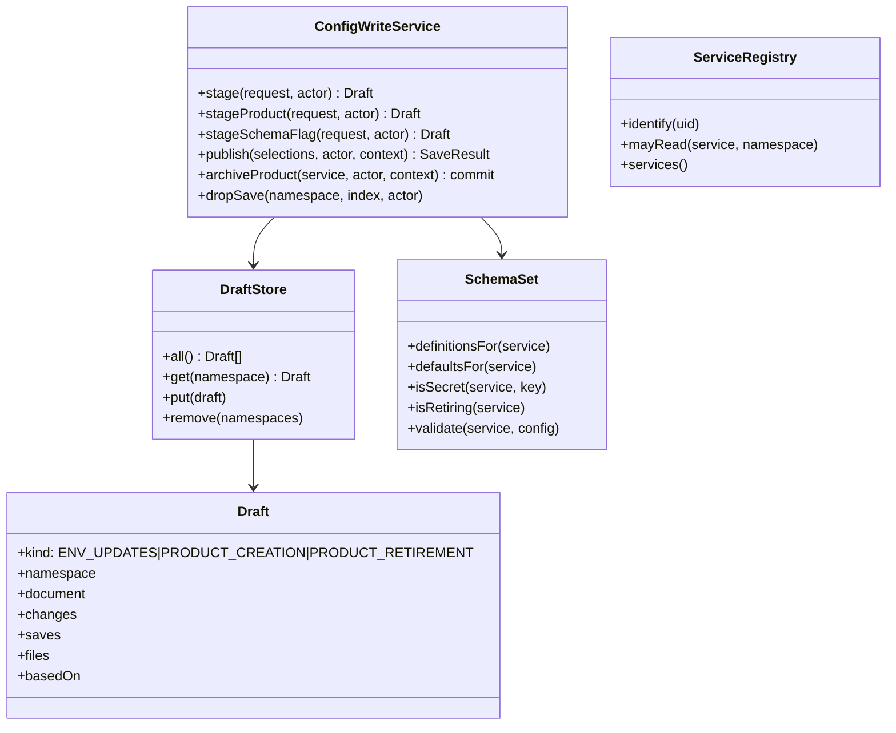
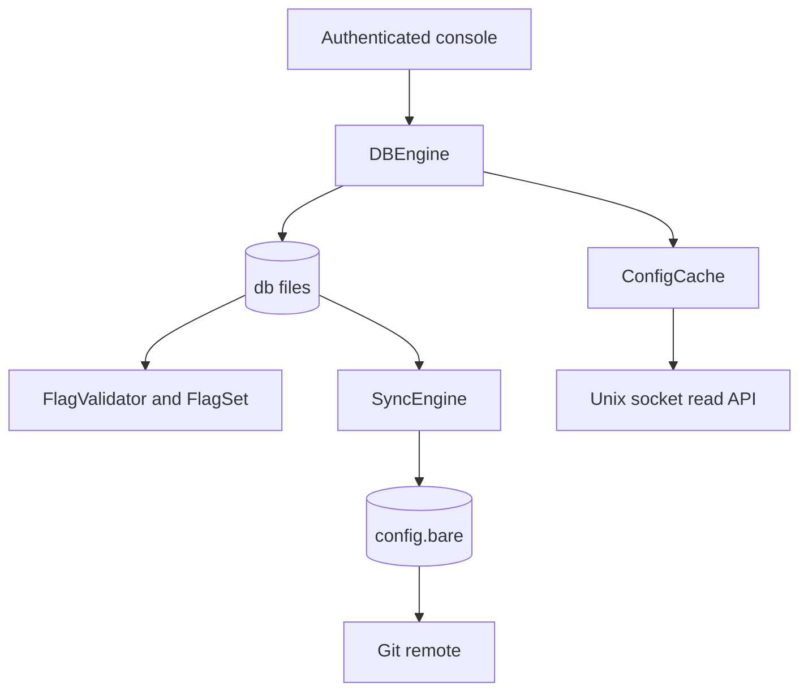

# System design

## Data at rest

The repository is the database. Nothing else persists a value.

| Path | Holds | Read by |
|---|---|---|
| `services.yaml` | The grant table: name, uid, namespaces, plus `version` | `ServiceRegistry` |
| `environments.yaml` | Which environments exist, in promotion order | `EnvironmentOrder` |
| `schema/<service>.yaml` | Key types, bounds, secrecy, descriptions, `version`, `retiring` | `SchemaSet` |
| `config/<service>/<env>.yaml` | The values, SOPS-encrypted per file, plus a `version` counter | `ConfigLoader` |
| `archived/<service>.yaml` | A removed product, whole | Nothing at runtime; it is a record |
| `.sops.yaml` | Which keys are encrypted, and to which age recipient | SOPS |

Outside git, on the host: `drafts.json` (unpublished work), `snapshot.json` (last known good, for
boot before git is readable), `break-glass.yaml` (the emergency credential, deliberately *not* in
the repository so it cannot be pushed).

### Document metadata

`version` and `sops` sit beside the values in a namespace file and are not configuration.
`isMetadataKey` is the single place that knows this; anything listing keys filters through it.

### The revision counter

`version` rises once per press of Save, not once per published state, and is clamped so it can
never go backwards. A consumer uses it to decide whether it is up to date, so a bump for a change
nobody made is a lie — which is why a retirement, which writes no values, does not touch it.

## APIs

### Read API — Unix socket, `GET /config/:service/:environment`

```json
{ "service": "iam", "environment": "prod", "commit": "9b81327",
  "retiring": false, "config": { "MFA_ENFORCEMENT": "all" } }
```

`retiring` is always present. Absent would read as "this server is too old to tell you", which is
a different fact from "this product is staying". Authorization is `SO_PEERCRED`: the kernel
reports the peer's uid, so nothing the caller sends is trusted.

### Console — HTTP, session cookie

`/`, `/p/:service`, `/p/new`, `/p/retiring`, `/drafts`, `/settings`, and the writes:
`POST /p/:service/:environment` (save, publish, create), `/p/:service/retire`,
`/p/:service/archive`, `/publish`, `/promote`, `/drafts/drop`, `/p/new`.

`new` and `retiring` are reserved product names: a static path segment beats a parameter, so a
product with either name would have a page nothing could reach.

### Webhook — HTTP, `POST /webhooks/github`

HMAC-verified. Absent secret closes the route rather than opening it.

## Classes



`Draft.kind` is the identity every decision reads. Three kinds behave differently at publish, in
the counts on the product list, and on the retiring page — and they used to be told apart by
shape, which twice caught something it was not meant to.

## Security

- **Secrets** are encrypted by SOPS before they reach a draft, a commit or a page. Each namespace
  file has its own envelope and its own Message Authentication Code (MAC), which is why archiving
  keeps each file verbatim rather than merging them.
- **The break-glass credential** lives outside the repository. It was committed once, and a
  commit is pushable.
- **Denials disclose nothing**: an ungranted namespace and a missing one look identical.
- **The settings page** is gated by a toggle and by identity, and both refusals are 404 — a 403
  would confirm the page exists.
- **Notices travel as codes, never as text.** A URL carrying a message let any link render words
  in the console's own voice.
- **`GIT_SSH_COMMAND`** pins the deploy key with `IdentitiesOnly`, so ssh cannot offer an agent
  key and authenticate as somebody else.

## Reliability

- A reload that cannot read a part keeps that part's last known good value. Denying every service
  on a failed read would be an outage; guessing would be worse.
- The read path never touches git: it serves from a cache rebuilt on reload.
- A push that fails leaves the commit durable and served locally, retried in the background, and
  the console says "not yet pushed" rather than pretending.
- One writer, one lock: git has no concurrency control, and the stale-base check must be atomic
  with the write it guards.

## Scalability

Not applicable in the usual sense. One host, one repository, a handful of products, and a read
path that answers from memory over a Unix socket. The registry is small by design; nothing here
 is expected to scale horizontally.

## Data engine and flags

### Ordered, recoverable file transactions

`writeMany(requests)` accepts ordered `{path, content, expectedEtag?, validate?, actor?, keys?}`
mutations. `content: null` deletes a file; `expectedEtag: null` requires that it does not exist.
Omitting the ETag retains unconditional-write compatibility. All validators run before staging;
all participating ETags are compared while their path locks are held. Duplicate paths, traversal,
engine-private paths, and symlinked database paths are refused.

The caller supplies the safe visibility order: schema and environments before registry on create;
registry before environments and schema on archive; environment values before schema on key
deletion. The current product creator now publishes its registry entry last.

Each changed payload is staged at mode `0600`. Only after every stage is durable does the engine
persist an intent with ordered paths, SHA-256 target hashes, attribution, and one target revision.
It publishes in order, writes that revision once, emits attribution, and removes the intent.
Unchanged files generate neither a new revision nor attribution events.

Recovery verifies all remaining payloads before replay, skips replacements whose targets already
match, and restores the recorded revision without incrementing it again. Attribution callbacks
are at-least-once on recovery; their stable `transactionId` and path identify a replay. They must
not recursively read the engine while its publication lock is held. A publication failure
requires restart recovery: subsequent database reads and writes fail instead of exposing a
partial transaction. Existing cache contents can remain available to consumers.

`snapshot(prefix)` returns `{revision, files}` under the publication lock. Independent `read()`
calls are individually consistent but do not form a multi-read transaction. Snapshot results
exclude `.journal`, `.revision`, and `.git`. The schema and flag flows retain their existing
contracts during this foundation slice.



The database revision is the opaque `commit` response token. `syncedCommit` is reserved for Git
provenance. Flag values absent for an environment resolve to `false`; unknown flag lookups in the
client also resolve to `false` unless a caller supplies a fallback.
# Direct-write safety checkpoint — 2026-09-10

A changed direct value save increments its document version once. A semantic no-op keeps the existing ciphertext and revision, with a compare-and-swap check. Each schema-secret field must independently contain an encrypted SOPS value; a different encrypted field is not proof. Encryption/decryption errors returned to callers omit dependency messages.
